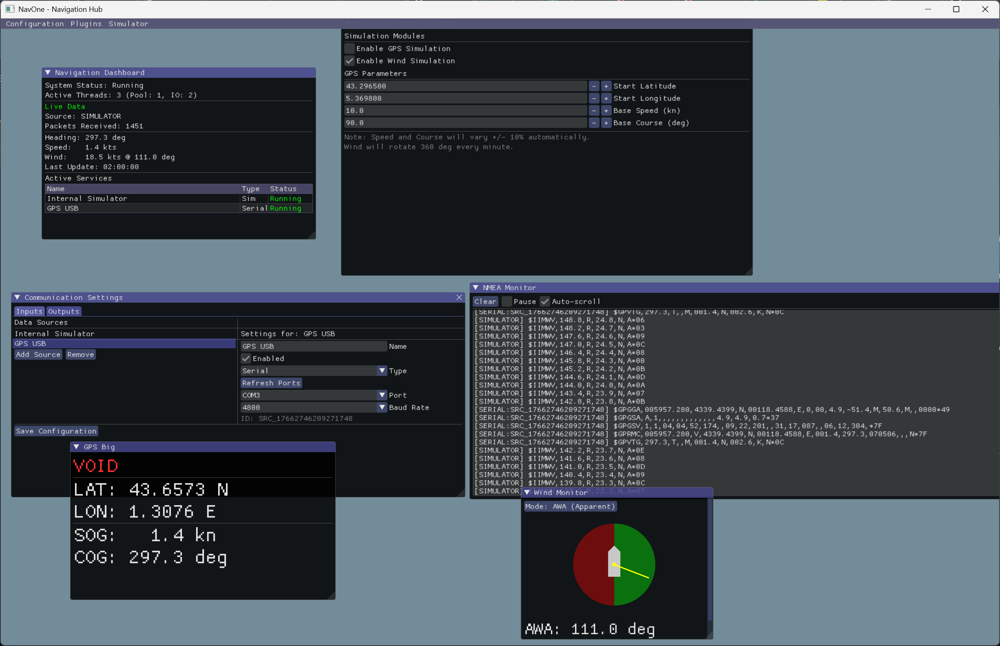

# NavOne

NavOne est un concentrateur de données de navigation moderne et modulaire écrit en C++. 
Il est conçu pour agréger, traiter et visualiser les données NMEA 0183 provenant de multiples sources.
Ce logiciel est prévu pour être capable de tourner sur des architectures légères (type Raspberry Pi)



## Fonctionnalités

*   **Connectivité Multi-Sources** : Connexion simultanée à plusieurs sources de données via Ports Série (COM) ou flux réseau UDP.
    Utilisation du multi-threading (pool de threads) de 2 manières :
    - taches de fond comme le simulateur
    - chaque I/O (UDP ou série) utilise son propre thread 
*   **Dashboard Temps Réel** : Visualisation claire des données essentielles (Cap, Vitesse fond, Vitesse/Angle du vent).
*   **Moniteur NMEA** : Inspection des trames brutes en temps réel avec fonctionnalités de pause et défilement automatique.
*   **Mode Simulateur** : Générateur de données intégré pour le développement et les tests sans matériel.
*   **Reroutage et multiplexage** : Possibilité de multiplexage des sources (UART, UDP, simulateur) et routage vers d'autres outputs
*   **Architecture Modulaire** : Séparation stricte entre le Cœur logique, le Réseau et l'Interface Graphique.
*   **Configuration Persistante** : Sauvegarde et chargement automatique de la configuration des sources (XML).
*   **Système de plugins** : Intégration simple de nouveaux plugins (dll) 

## Technologies Utilisées

*   **Langage** : C++20
*   **Système de Build** : CMake
*   **Interface Graphique** : [Dear ImGui](https://github.com/ocornut/imgui) (Branche Docking)
*   **Réseau** : ASIO (Standalone)
*   **Parsing XML** : TinyXML2

## Installation et Compilation

### Prérequis

*   CMake (3.10 ou supérieur)
*   Compilateur C++ compatible C++20 (MSVC, GCC, Clang)

#### Linux (Ubuntu/Debian)
Pour compiler sur Linux, vous devez installer les bibliothèques de développement X11 et OpenGL nécessaires pour GLFW :
```bash
sudo apt-get update
sudo apt-get install build-essential cmake libx11-dev libxrandr-dev libxinerama-dev libxcursor-dev libxi-dev libgl1-mesa-dev
```

#### Raspberry Pi (Raspberry Pi OS)
Les instructions sont identiques à celles pour Debian/Ubuntu. Assurez-vous d'utiliser une version récente de l'OS (Raspberry Pi OS Bookworm ou plus récent) pour disposer d'un compilateur compatible C++20 (GCC 10+).

```bash
sudo apt-get update
sudo apt-get install build-essential cmake git libx11-dev libxrandr-dev libxinerama-dev libxcursor-dev libxi-dev libgl1-mesa-dev
```

### Instructions de Build

1.  Cloner le dépôt :
    ```bash
    git clone https://github.com/swanee-31/nav-one.git
    cd nav-one
    ```

2.  Créer le dossier de build :
    ```bash
    mkdir build
    cd build
    ```

3.  Configurer et Compiler :
    ```bash
    cmake ..
    cmake --build .
    ```

4.  Lancer l'application :
    *   Windows : `.\src\Debug\NavOne.exe`
    *   Linux/Mac : `./src/NavOne`

## Utilisation

1.  **Configuration** : Allez dans le menu `Configuration > Communication` pour ajouter des sources Série ou UDP.
2.  **Monitoring** : Activez `Configuration > NMEA Monitor` pour voir les données brutes.
3.  **Simulation** : Utilisez `Simulator > Start Simulator` pour tester l'interface sans capteurs réels.

## Architecture

Le projet suit une architecture modulaire :
- `src/core` : Logique métier et structures de données.
- `src/network` : Gestion des communications (IO asynchrone).
- `src/gui` : Interface utilisateur (Fenêtres et Widgets).
- `src/app` : Orchestration de l'application.
- `src/parser` : parsers de données
- `src/plugins` : plugins additionnels (GPS, Vent...)

## Auteur
Fabrice Meynckens - fabrice.meynckens@gmail.com

## Licence
MIT

